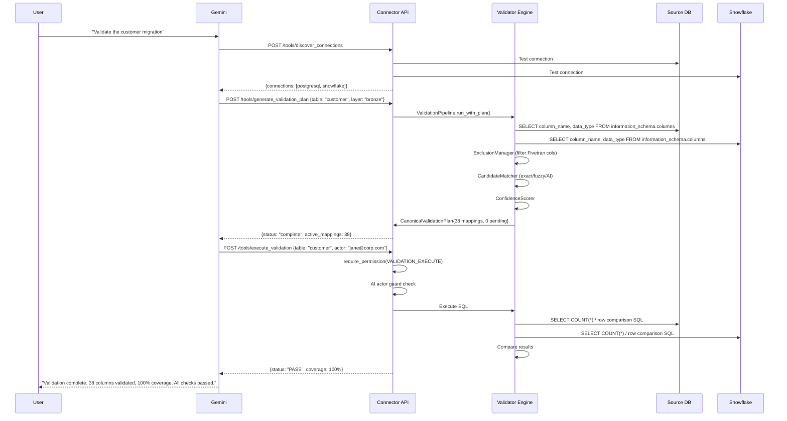
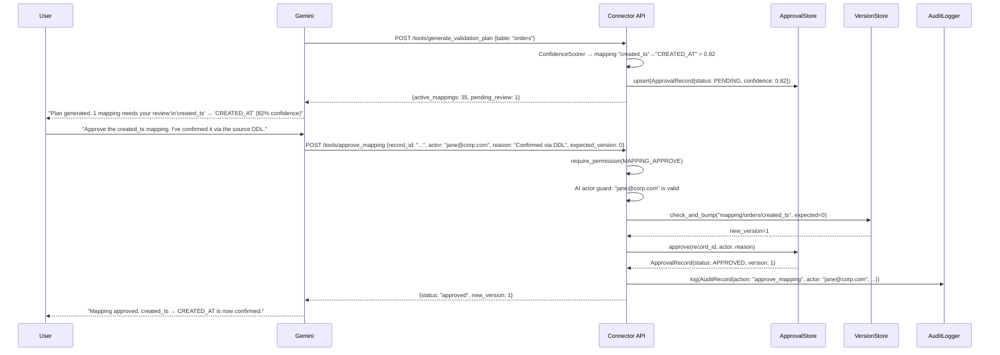
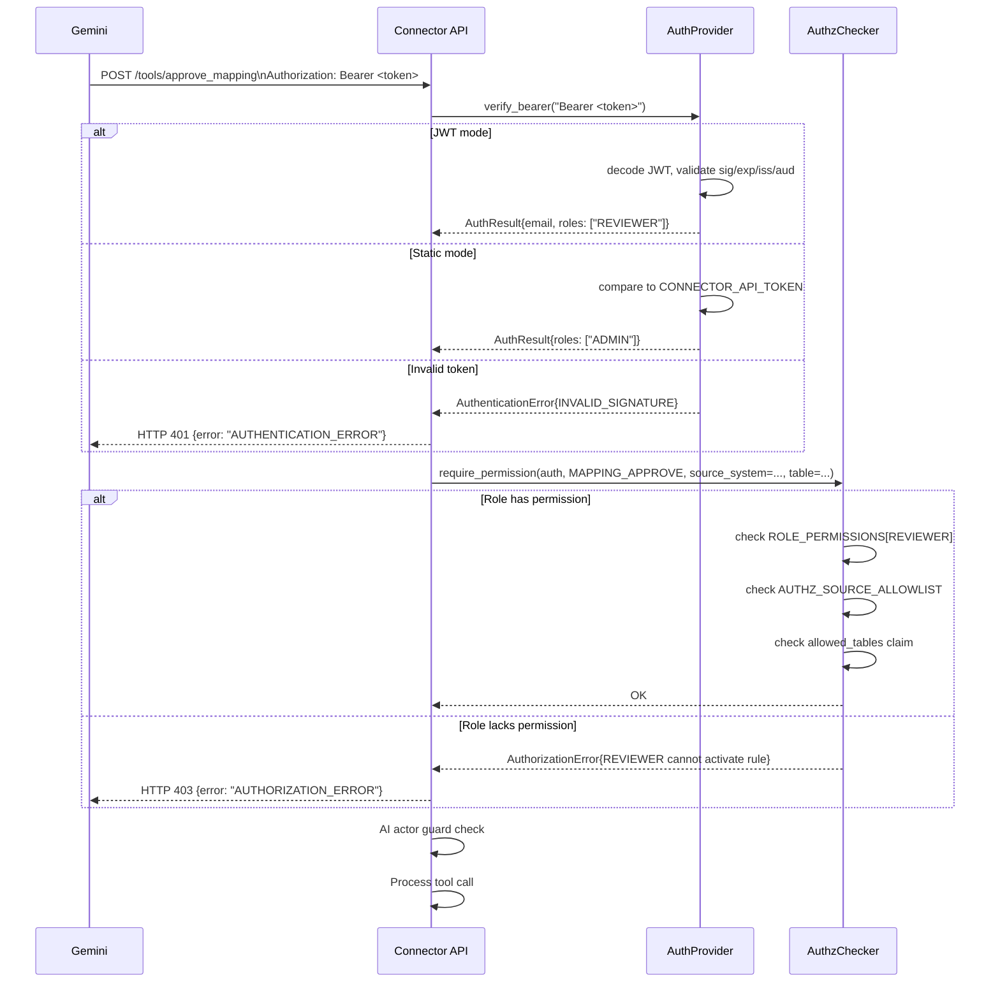
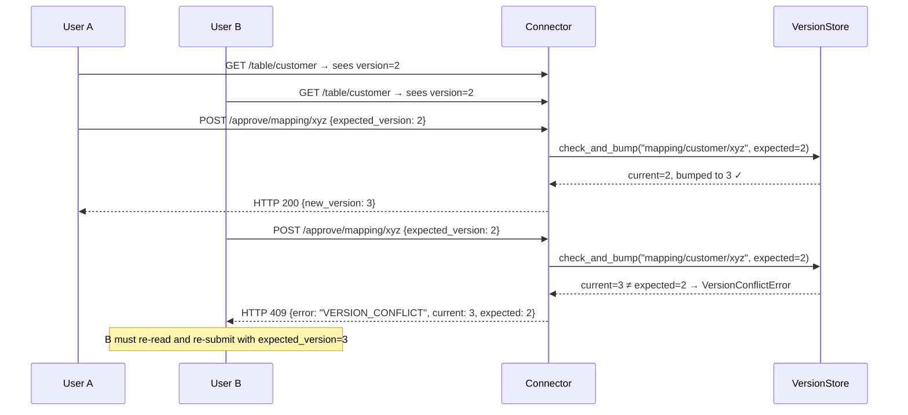
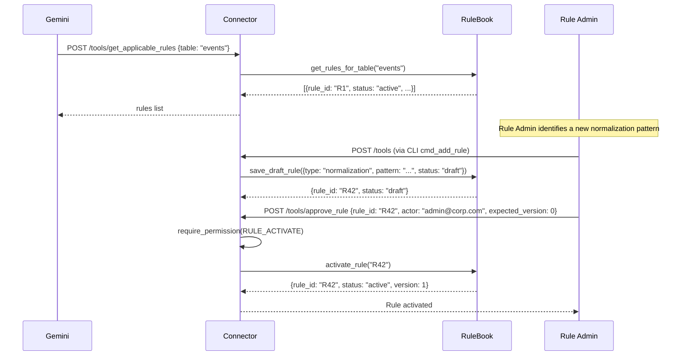
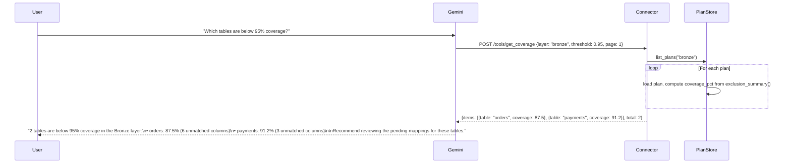

# Sequence Diagrams

## 1. Full Validation Flow (Happy Path)

---

## 2. Human-in-the-Loop Approval Flow

---

## 3. Authentication and Authorization Check

---

## 4. Optimistic Concurrency Conflict

---

## 5. Rule Book Lifecycle

---

## 6. Multi-Source Coverage Query

