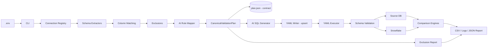

# Version 3.1 Architecture

## The Contract

The **CanonicalValidationPlan** is the single source of truth. It is persisted
as JSON by `PlanStore` to `output/plans/<layer>/<table>.plan.json`.

Everything downstream is a **render target** derived from that plan:

```text
metadata → matching → AI → CanonicalValidationPlan → plan.json   ← CONTRACT
                                                        ├→ SQL      (in memory)
                                                        ├→ YAML     (regenerable)
                                                        └→ reports  (coverage)
```

Rules that follow from this:

- YAML is **never** read back to reconstruct intent. If you need to know what a
  run intended to validate and what it excluded, read the plan.
- YAML files are generated artefacts. Do not hand-edit them; regenerate.
- Plan writes are atomic (temp file + replace) and round-trip losslessly, so a
  crashed run never leaves a half-written contract behind.
- `PLAN_SCHEMA_VERSION` gates forward compatibility — a plan written by a newer
  build is rejected rather than silently misread.

## High-Level Flow



## Connection Layer

`src/db/factory.py` loads credentials using `python-dotenv` and creates the correct adapter.

Adapters implement a common interface:

```python
connect()
execute_query(query)
```

The factory infers the profile when YAML omits `source_name`:

- PostgreSQL → `SRC_1`
- MSSQL → `SRC_2`
- Athena → `SRC_3`
- Snowflake → `SNOWFLAKE`

The MSSQL adapter uses the working connection settings:

```text
TrustServerCertificate=yes
Encrypt=optional
Connection Timeout=30
```

## Generation Layer

`src/validation_pipeline.py` coordinates:

1. Source schema extraction
2. Target schema extraction
3. Column exclusion
4. Column matching
5. AI rule assignment
6. **Plan construction and persistence** (the contract)
7. AI SQL generation for both sides
8. Dynamic suite generation
9. YAML serialization (idempotent upsert)

`QueryOutputManager.generate_from_plan()` persists the plan **before** rendering,
prints the coverage report, then writes YAML.

`DynamicSuiteGenerator` profiles the source table, selects checks, and calls `QueryOptimizer`.

### Idempotent YAML writes

`config/bronze/count_validation/bronze.yaml` is shared by every table. The writer
parses the existing document, **upserts** the table key, and rewrites the whole
file. Regenerating the same table N times produces byte-identical output.

The previous implementation appended raw text, so a second run created a
duplicate top-level key. YAML resolves duplicates last-wins, which meant the
file silently disagreed with itself about what would run. `validate_cli.py lint`
now detects this class of problem.

The shared count file deliberately carries **no generation timestamp** — a
timestamp would make every run produce a diff even when nothing changed.
Per-table provenance (when, which model) lives in the plan JSON.

## AI Layer

**Generation is AI-only. There is no rule-based fallback.**

Both the column mapping and the data-validation SQL for *both* sides are produced
by the model. When AI is unavailable or its output fails dialect validation, the
run raises (`AIRuleMappingError` / `AISQLGenerationError`) instead of degrading.

Why the fallback was removed: static output was indistinguishable downstream from
reviewed AI output. A missing `DIAL_API_KEY` therefore downgraded correctness
without downgrading the reported confidence — runs looked green while comparing
guesses. Failing loudly is the feature.

The AI prompt receives:

- Source and target database types
- Source and target column types
- Transformation rule
- Castability requirements
- NULL and timezone behavior
- Required aliases and filters

### Self-correction loop

Generated SQL is checked for dialect violations (PostgreSQL casts in MSSQL, the
missing `<<NULL>>` sentinel, absent required aliases, missing commas). Failures
are fed back to the model for up to `MAX_GENERATION_ATTEMPTS` (3). If the last
attempt still fails, generation raises with every attempt's diagnostics.

### Alias alignment

Both SELECT lists are AI-generated from the same plan and told to use the
**identical alias**, always derived from the source column name
(`<source_column>_normalized`). This is what keeps a renamed target column from
being compared against the wrong source column. Previously the source side was
AI-generated and the target side rule-based, and the two only lined up because
of incidental case-folding downstream.

### Deterministic by design

Row counts remain hand-written `COUNT(*)`. There is no dialect ambiguity worth a
model call, and a deterministic count cannot drift from intent.

## Exclusion Layer

Exclusions come from:

- `config/exclusions.yaml`
- Static ETL/Fivetran exclusions
- Interactive user selections
- `--exclude` command-line values

The source column list is filtered before matching, so excluded columns do not
reach SQL generation.

### Exclusions are always reported

Every run emits an `ExclusionReport` next to its result:

```text
6 of 9 columns validated (66.7%) — 3 excluded: uTS (rowversion — not comparable),
_FIVETRAN_SYNCED (pattern ^_FIVETRAN_.*), SSN (PII policy)
```

Coverage and pass rate are reported **together, never separately**. A validator
that silently drops columns is worse than no validator: it emits a green 100%
that nobody questions.

- Below 80% column coverage the run is flagged `LOW COVERAGE` and any PASS is
  labelled partial.
- Batch runs aggregate per-table coverage and name every thin table.
- A table with **no plan** reports coverage as UNKNOWN, never as complete —
  silence must not read as full coverage.
- Every excluded column carries a reason. Exclusion without a recorded reason is
  treated as a defect.

## Validation Layer

### Config schema validation

Before a single database connection is opened, every YAML config is validated
with Pydantic models in `src/validation/config_schema.py`:

- required keys present and non-empty
- queries are `SELECT` statements
- `source` / `target` name a supported dialect
- `source_name` / `target_name` resolve to credentials that exist in the environment
- no duplicate top-level table keys (scanned from raw text, because
  `yaml.safe_load` collapses duplicates before Pydantic can see them)

A file that fails is skipped with an `ERROR` result naming the file, table, and
field — not a `KeyError` thrown mid-run after connections are already open.

Hand-authored policy files (`exclusions.yaml`, `database_registry.yaml`) are not
validated against this schema; only files under `count_validation/` and
`data_validation/` are.

### Count validator

Executes source and target count queries and compares scalar row counts.

### Data validator

Executes normalized queries, resolves primary-key columns case-insensitively, supports normalized aliases, detects missing rows, and writes mismatch CSV files.

### Dynamic checks

The dynamic suite supports:

- NULL percentage
- Distinct count
- MIN/MAX
- SUM
- Duplicate business keys
- VALUE_DIST grouped result sets

## Output Layer

Reports are stored under repository `output/`, independent of the current working directory. Running from `src/` does not create a separate `src/output/` tree.

| Path | Contents | Hand-editable |
|---|---|---|
| `output/plans/<layer>/<table>.plan.json` | The contract | No — generated |
| `config/bronze/data_validation/<table>.yaml` | Render target | No — regenerate |
| `config/bronze/count_validation/bronze.yaml` | Render target (shared, upserted) | No — regenerate |
| `config/exclusions.yaml` | Exclusion policy | **Yes** |
| `config/database_registry.yaml` | Non-secret connection metadata | **Yes** |
| `output/<layer>/validation_<run_id>/` | CSV results and logs | No |
