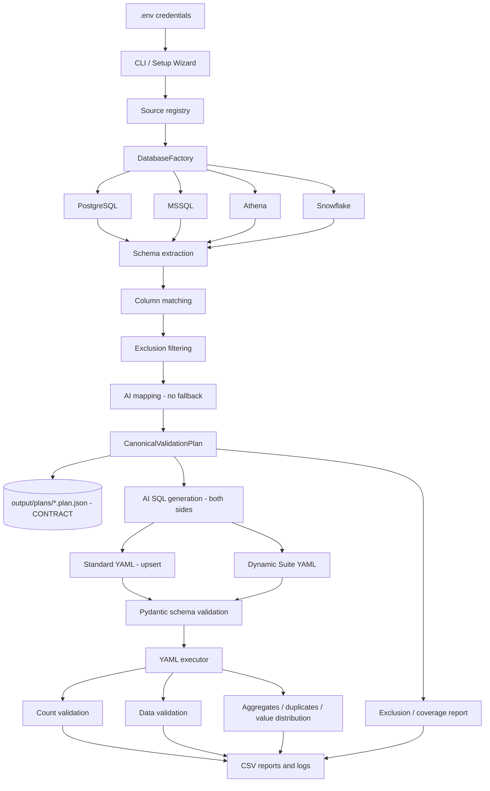

# Migration Validator 3.1 — Handover Guide

**Audience:** The engineer taking ownership of the Migration Validator.

**Purpose:** This guide records the implemented architecture, operating workflow, testing process, output locations, security decisions, and known data-quality findings for version 3.1.

---

## 1. What the Project Does

Migration Validator compares a source database with a Snowflake target after migration.

Supported source systems:

- PostgreSQL
- Microsoft SQL Server
- AWS Athena

Target system:

- Snowflake

The framework validates both structure and data by extracting schemas, matching columns, generating normalized SQL, executing YAML-defined queries, comparing results, and writing reports.

---

## 2. Current Architecture



### Three rules that explain the design

1. **The plan is the contract.** `output/plans/<layer>/<table>.plan.json` is the
   single source of truth. YAML and SQL are render targets generated from it and
   are never read back to reconstruct intent. Regenerate; do not hand-edit.
2. **Generation is AI-only.** `DIAL_API_KEY` is required. The static rule mapper
   and the rule-based SQL fallback were removed because their output was
   indistinguishable downstream from reviewed AI output — a missing key silently
   downgraded correctness while the run still reported success.
3. **Exclusions are always reported.** Coverage is printed next to every pass
   rate, every excluded column carries a reason, and coverage under 80% is
   flagged. Unknown coverage is never treated as full coverage.

### Main implementation areas

| Area | Main files | Responsibility |
|---|---|---|
| CLI | `src/validate_cli.py` | Interactive and command-line workflows |
| Pipeline | `src/validation_pipeline.py` | Schema extraction, matching, SQL/YAML generation |
| Database factory | `src/db/factory.py` | Loads `.env` profiles and creates adapters |
| Database adapters | `src/db/*.py` | PostgreSQL, MSSQL, Snowflake, Athena execution |
| Matching | `src/matching/` | Exact, normalized, fuzzy, and AI-assisted matching |
| Rules | `src/rules/`, `src/ai_transformation/` | Type conversion and normalization rules |
| Standard SQL | `src/generated_queries/` | Main validation SQL and YAML files |
| Dynamic suite | `src/dynamic_suite/` | NULL%, distinct, MIN/MAX, SUM, duplicates, VALUE_DIST |
| Validation engines | `src/validation/` | Count and row-level comparison |
| Exclusions | `src/exclusions/`, `config/exclusions.yaml` | Automatic and user-selected column exclusions |
| Test orchestration | `tests/e2e/run_all_tests.py` | Full framework test from imports to live results |

---

## 3. Credentials and Configuration

Credentials are loaded from `.env`. Passwords are not stored in YAML configuration files.

Typical source slots:

```env
SRC_1_TYPE=postgresql
SRC_1_HOST=localhost
SRC_1_PORT=5432
SRC_1_DATABASE=fms
SRC_1_SCHEMA=public
SRC_1_USERNAME=...
SRC_1_PASSWORD=...

SRC_2_TYPE=mssql
SRC_2_HOST=...
SRC_2_PORT=1433
SRC_2_DATABASE=DevT5000
SRC_2_SCHEMA=dbo
SRC_2_USERNAME=...
SRC_2_PASSWORD=...

SRC_3_TYPE=athena
SRC_3_REGION=...
SRC_3_DATABASE=...
SRC_3_QUERY_RESULT_LOCATION=s3://...

SNOWFLAKE_ACCOUNT=...
SNOWFLAKE_DATABASE=...
SNOWFLAKE_SCHEMA=...
SNOWFLAKE_USERNAME=...
SNOWFLAKE_PASSWORD=...
```

### Credential policy

- Normal CLI operation uses `.env` only.
- Connection profiles are no longer shown in the normal menu.
- Legacy profile flags are ignored in favor of `.env`.
- `config/database_registry.yaml` contains only non-secret database/schema fallback metadata.
- Usernames, passwords, tokens, and keys must remain in `.env`.

### Database-type profile inference

If a YAML block omits `source_name`, `DatabaseFactory` infers the profile:

| YAML source | `.env` profile |
|---|---|
| `postgresql` | `SRC_1` |
| `mssql` | `SRC_2` |
| `athena` | `SRC_3` |
| `snowflake` | `SNOWFLAKE` |

---

## 4. Normal Execution Workflow

From the repository root:

```powershell
cd C:\EPAM-Personal\Migration-validator
```

Start the CLI:

```powershell
python src\validate_cli.py
```

Main workflows:

- `[1] Single Table`: select a source table, target table, exclusions, and generate SQL/YAML.
- `[2] Run Tables`: process multiple source tables with per-table exclusions.
- `[3] List tables`: discover tables from configured databases.
- `[9] Execute YAML`: execute saved source and target queries and compare results.

Direct commands:

```powershell
python src\validate_cli.py connections
python src\validate_cli.py list-tables
python src\validate_cli.py rules
python src\validate_cli.py lint
```

`lint` needs no database and no API key. Run it after any generation and in CI:
it catches duplicate table keys, schema violations, `.env` references that
resolve to nothing, and plan/config drift.

---

## 5. Column Exclusions

Excluded columns are removed before mapping and SQL generation.

They are not included in:

- AI prompts
- Source SQL
- Snowflake target SQL
- Data validation
- NULL percentage checks
- Distinct checks
- MIN/MAX/SUM checks
- Duplicate checks
- VALUE_DIST queries
- Dynamic suites

Automatic exclusions include Fivetran and common ETL metadata columns. User-selected exclusions can be entered by column number or name in the interactive workflow.

Command-line example:

```powershell
python src\validate_cli.py generate --source 2 --pg-table Addresses --sf-table ADDRESSES --exclude uTS,GeographyData
```

Generated YAML files must be regenerated after changing exclusions. Existing YAML files are not retroactively modified.

### Exclusions are never silent

Every excluded column is recorded in the plan with a reason, and every run prints
the accounting next to its result:

```text
COLUMN COVERAGE — Addresses
----------------------------------------------------------
Validated : 24 / 27 (88.9%)
Excluded  : 3
  ✗ uTS             [timestamp] — rowversion — not comparable
  ✗ GeographyData   [geography] — binary type, excluded by policy
  ✗ LegacyFlag                  — no matching target column
```

Rules the framework enforces:

- Coverage and pass rate are reported together, never separately.
- Coverage below 80% is flagged `LOW COVERAGE`; any PASS is labelled partial.
- A table with no plan reports coverage as UNKNOWN, never as complete.
- Batch runs aggregate coverage and name every thin table by name.

This exists because exclusions are the easiest way to turn a validator into a
rubber stamp. If exclusion is not loudly visible in the output, a 100% pass rate
stops meaning anything.

To audit exactly what a past run skipped, read its plan:

```powershell
Get-Content output\plans\bronze\addresses.plan.json | ConvertFrom-Json |
  Select-Object -ExpandProperty exclusions
```

---

## 6. SQL Generation Rules

**All comparison SQL is AI-generated, on both sides.** `DIAL_API_KEY` is required.
There is no rule-based fallback; generation raises `AISQLGenerationError` rather
than emitting SQL of unknown quality.

Row counts remain deterministic `COUNT(*)` — no dialect ambiguity worth a model
call, and a hand-written count cannot drift from intent.

Generated SQL is validated before it is accepted (forbidden dialect constructs,
the `<<NULL>>` sentinel, required aliases, missing commas). Failures are fed back
to the model for up to three attempts.

The generator preserves the source dialect and uses Snowflake syntax for the target.

### MSSQL source

Uses SQL Server-compatible expressions such as:

```sql
CAST(column AS VARCHAR(MAX))
FORMAT(column, 'yyyy-MM-dd HH:mm:ss')
LTRIM(RTRIM(column))
```

It rejects PostgreSQL-only constructs such as:

- `column::type`
- `AS TEXT`
- `TO_CHAR(...)`
- `JSONB`
- `encode(...)`

### PostgreSQL source

May use:

```sql
CAST(column AS TEXT)
TO_CHAR(...)
column::jsonb
AT TIME ZONE
encode(...)
```

### Snowflake target

Uses Snowflake-compatible expressions such as:

```sql
CAST(column AS STRING)
TO_VARCHAR(...)
TRY_TO_TIMESTAMP(...)
PARSE_JSON(...)
TO_JSON(...)
HEX_ENCODE(...)
```

### Safety validation

`src/dynamic_suite/sql_validator.py` validates generated query pairs before YAML serialization. Invalid AI-generated SQL falls back to deterministic rule-based SQL.

---

## 7. Dynamic Validation Suite

Dynamic suite generation is controlled by:

- `src/dynamic_suite/suite_generator.py`
- `src/dynamic_suite/query_optimizer.py`
- `src/dynamic_suite/sql_validator.py`

Supported dynamic checks:

- Row count
- Full normalized data validation
- NULL percentage
- Distinct count
- MIN/MAX
- SUM
- Duplicate business-key check
- VALUE_DIST

`VALUE_DIST` is a separate grouped query, not a scalar aggregate proxy:

```sql
SELECT
    column,
    COUNT(*) AS value_count
FROM table
GROUP BY column
ORDER BY value_count DESC;
```

All generated aggregate SELECT expressions are comma-separated correctly.

---

## 8. YAML Execution and Comparison

YAML files use this structure:

```yaml
tables:
  table_name:
    validations:
      count_validation:
        source: mssql
        sourcequery: SELECT ...
        target: snowflake
        targetquery: SELECT ...
      data_validation:
        pksourcecolumn: id
        pktargetcolumn: ID
        sourcequery: SELECT ...
        targetquery: SELECT ...
```

The executor:

1. Loads and flattens grouped YAML.
2. Infers the correct source profile from the declared source type.
3. Executes source and target queries.
4. Compares counts or rows.
5. Resolves primary keys case-insensitively, including normalized aliases such as `ID_normalized`.
6. Compares rows independently of database return order.
7. Canonicalizes JSON and HStore representations before comparison.
8. Writes summary and mismatch CSV files.

A `PASS` means source and target results match. A `FAIL` means a real data-quality difference was detected. An `ERROR` means the framework could not execute the validation.

---

## 9. Output Locations

All runtime reports are written to the repository root:

```text
C:\EPAM-Personal\Migration-validator\output\
```

Typical layout:

```text
output/
├── plans/                      ← THE CONTRACT — read this to audit a run
│   └── bronze/
│       ├── addresses.plan.json
│       └── acctsoftware.plan.json
└── bronze/
    └── validation_<run_id>/
        ├── validation_<run_id>.log
        ├── count_validation_<run_id>/
        │   └── count_validation_summary.csv
        └── data_validation_<run_id>/
            ├── data_validation_summary.csv
            └── <table>_data_validation_mismatch_<run_id>.csv
```

Each plan JSON records the source/target identity, every column mapping with its
match method and confidence, the full exclusion accounting, the model used, and
the generation timestamp. Plans are written atomically and round-trip losslessly.

### What is safe to edit

| Path | Hand-editable |
|---|---|
| `config/exclusions.yaml` | **Yes** |
| `config/database_registry.yaml` | **Yes** |
| `config/bronze/**/*.yaml` | No — regenerate |
| `output/plans/**` | No — generated |
| `output/**` reports | No |

The orchestrated test report is written to:

```text
output/test_runs/<run_id>/test_report.json
```

Batch manifests and plans are written under:

```text
output/batch/
```

---

## 10. Complete Test Process

Run these in order and stop at the first failure. Steps 1–3 need no database and
no API key.

### 1. Unit and contract tests

```powershell
python -m pytest -q
```

Covers plan round-tripping, exclusion reporting, config schema validation,
idempotent YAML writes, and regression guards proving the static fallbacks are
gone.

### 2. Config lint

```powershell
python src\validate_cli.py lint
```

Duplicate table keys, schema violations, broken `.env` references, plan/config
drift. Exit code 0/1 — suitable for CI.

### 3. Non-live test

Use this when databases are unavailable:

```powershell
python tests\e2e\run_all_tests.py --skip-live
```

This checks:

- Dependencies
- Imports
- YAML files
- Dialect guards
- Aggregate SQL
- VALUE_DIST SQL
- Existing regression tests
- Output artifact discovery

### Full live test

Run from the repository root:

```powershell
python tests\e2e\run_all_tests.py
```

The full runner checks:

1. Dependencies and imports
2. YAML configuration loading
3. Generated SQL and dialect checks
4. Regression tests
5. PostgreSQL connection
6. MSSQL connection
7. Snowflake connection
8. Athena connection
9. Live source-to-target validation
10. CSV/log output artifacts

Optional table selection:

```powershell
python tests\e2e\run_all_tests.py --layer bronze --tables Addresses AcctSoftware
```

Optional validation selection:

```powershell
python tests\e2e\run_all_tests.py --validation-types count_validation
```

### Existing regression tests

```powershell
python -m pytest -q
```

The environment must have `pytest` installed. The E2E runner automatically searches available Python installations for pytest.

### Connection-only test

```powershell
python test_env_connections.py
```

Expected result:

```text
PostgreSQL  PASS
MSSQL       PASS
Snowflake   PASS
Athena      PASS
```

---

## 11. Current Verified Result

The latest full orchestrated run passed all framework stages:

```text
Dependencies/imports       PASS
YAML loading                PASS
SQL dialect checks          PASS
Regression tests            PASS
Database connections        PASS
Live validation execution   PASS
Output artifacts            PASS
```

The latest live data findings were:

```text
Addresses:
  Count validation: PASS, 24 source / 24 target
  Data validation : PASS

AcctSoftware:
  Count validation: FAIL, 19 source / 17 target
  Data validation : FAIL, rows 18 and 19 missing in target
```

These AcctSoftware results are genuine migration data differences, not framework execution errors.

---

## 12. Troubleshooting

### YAML file is not listed

Confirm the file is under:

```text
config/bronze/count_validation/
config/bronze/data_validation/
```

### Database connection error

Run:

```powershell
python test_env_connections.py
```

Then check the relevant `SRC_N_*` values in `.env`.

### MSSQL pre-login error

Confirm the machine has the configured ODBC driver and that the server is reachable. The shared adapter uses:

```text
TrustServerCertificate=yes
Encrypt=optional
Connection Timeout=30
```

### Data validation primary-key error

Confirm the YAML has:

```yaml
pksourcecolumn: source_key
pktargetcolumn: TARGET_KEY
```

The validator also accepts normalized aliases such as `source_key_normalized`.

### PASS versus FAIL versus ERROR

- `PASS`: source and target match.
- `FAIL`: source and target executed, but data differs.
- `ERROR`: query or connection could not execute.

Always read the coverage line alongside the status. A PASS covering 40% of
columns and a PASS covering 100% are not the same result.

### "DIAL_API_KEY is not set"

Expected behaviour, not a regression. Generation is AI-only. Set the key in
`.env` and confirm VPN access to the DIAL endpoint.

### Coverage reported as UNKNOWN

The YAML exists but its plan does not, so there is no record of what was
excluded. Regenerate the table. Unknown coverage is deliberately not treated as
full coverage.

### No CSV visible

Use the run ID printed in the console and inspect:

```text
output/<layer>/validation_<run_id>/
```

---

## 13. Safe Extension Rules

### Invariants — do not break these

1. **Never reintroduce a silent fallback.** If AI is unavailable or its output
   fails validation, raise. The value of this tool is that a green result means
   something; a degraded path that reports success destroys that.
2. **Never read YAML to reconstruct intent.** The plan is the contract. If you
   need to know what a run validated or excluded, load the plan via `PlanStore`.
3. **Never write config YAML by appending.** Parse, upsert, rewrite. Appending
   creates duplicate keys that YAML resolves last-wins, silently.
4. **Never report a pass rate without coverage.** Every result surface must carry
   the `ExclusionReport` headline.
5. **Never exclude a column without a recorded reason.** An exclusion with no
   reason is a defect, not a configuration choice.

### When adding a source database

1. Add its adapter under `src/db/`.
2. Register it in `src/db/factory.py`.
3. Add dialect-specific extractor behavior.
4. Add the dialect to `SUPPORTED_SOURCES` in `src/validation/config_schema.py`.
5. Add its syntax rules to the AI system prompt in
   `src/generated_queries/ai_sql_generator.py`.
6. Add forbidden-construct checks to `_validate_generated_query` so bad output is
   rejected and fed back to the model.
7. Add a connection stage to `tests/e2e/run_all_tests.py`.
8. Add a pytest case under `tests/`.
9. Run `pytest`, `lint`, then both `--skip-live` and full live E2E tests.

### When adding a new validation type

1. Add a block model to `src/validation/config_schema.py` so it is validated at
   load time.
2. Add it to the validation enum or executor contract.
3. Implement source and Snowflake SQL generation from the plan.
4. Add comparison behavior.
5. Add summary and mismatch output.
6. Add pytest coverage and an orchestrator assertion.
7. Update this handover guide.

### When changing the plan shape

Bump `PLAN_SCHEMA_VERSION` in `src/core/validation_plan.py` and keep
`to_dict()` / `from_dict()` lossless — `tests/test_plan_contract.py` enforces the
round trip.

Never commit `.env`, passwords, tokens, or saved credential files.
